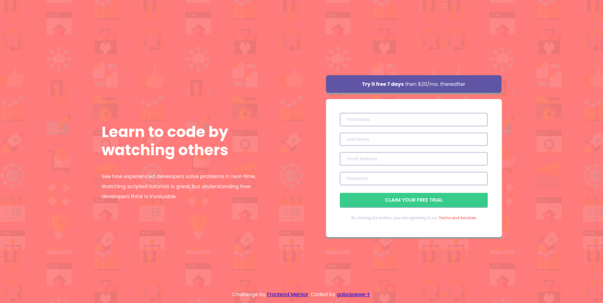
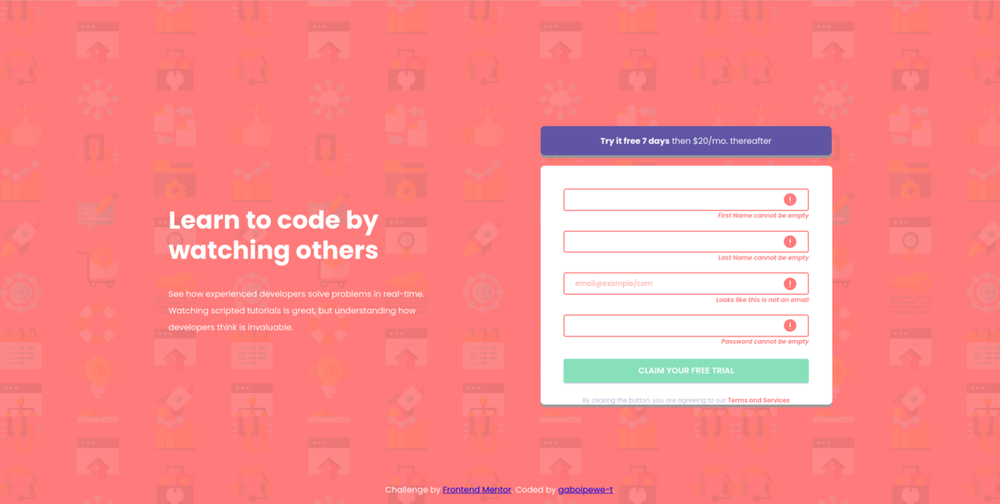
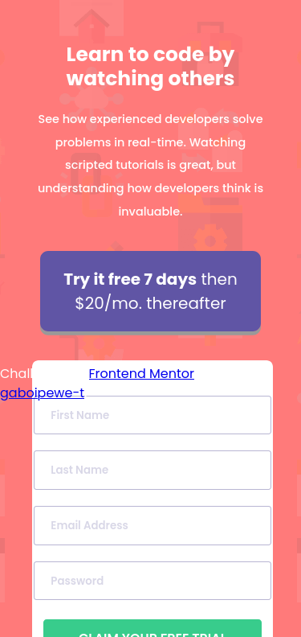

# Frontend Mentor - Intro component with sign up form solution

This is a solution to the [Intro component with sign up form challenge on Frontend Mentor](https://www.frontendmentor.io/challenges/intro-component-with-signup-form-5cf91bd49edda32581d28fd1). Frontend Mentor challenges help you improve your coding skills by building realistic projects. 

## Table of contents

- [Overview](#overview)
  - [The challenge](#the-challenge)
  - [Screenshot](#screenshot)
  - [Links](#links)
- [My process](#my-process)
  - [Built with](#built-with)
  - [What I learned](#what-i-learned)
  - [Useful resources](#useful-resources)
- [Author](#author)

**Note: Delete this note and update the table of contents based on what sections you keep.**

## Overview

### The challenge

Users should be able to:

- View the optimal layout for the site depending on their device's screen size
- See hover states for all interactive elements on the page
- Receive an error message when the `form` is submitted if:
  - Any `input` field is empty. The message for this error should say *"[Field Name] cannot be empty"*
  - The email address is not formatted correctly (i.e. a correct email address should have this structure: `name@host.tld`). The message for this error should say *"Looks like this is not an email"*

### Screenshot

#### Desktop Screenshot

#### Active State Screenshot

#### Mobile Screenshot

### Links

- Solution URL: [gaboipewe-t/intro-component-with-signup-form-master](https://github.com/gaboipewe-t/intro-component-with-signup-form-master)
- Live Site URL: [Frontend Mentor | Intro component with sign up form](https://intro-component-with-signup-thobo.netlify.app/)

## My process

### Built with

- Semantic HTML5 markup
- CSS custom properties
- Flexbox
- CSS Grid
- Vanilla JS

### What I learned

I learnt how to use the HTML DOM, manipulating elements using javascript and adding interactivity elements. Not forgetting using functional programming elements provided out of the box by JS

### Continued development

I would like to continue honing my web development skills, priotizing mostly on full stack development.

### Useful resources

- [Mozilla Developer Network](https://developer.mozilla.org/docs) - This helped me for XYZ reason. I really liked this pattern and will use it going forward.

## Author

- Frontend Mentor - [@gaboipewe-t](https://www.frontendmentor.io/profile/gaboipewe-t)
- Twitter - [@gaboipewe_thobo](https://www.twitter.com/gaboipewe_thobo)
